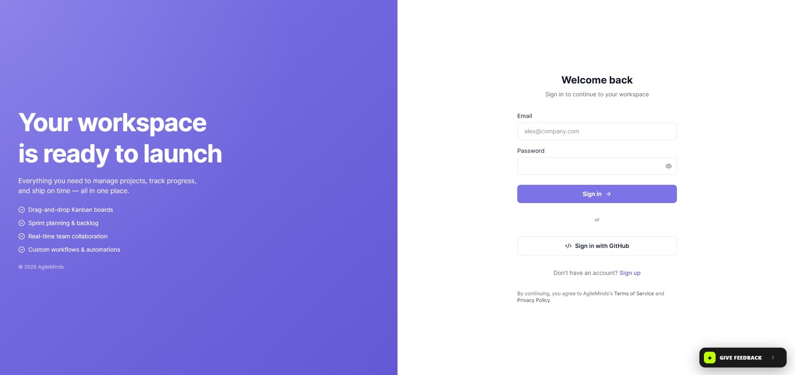
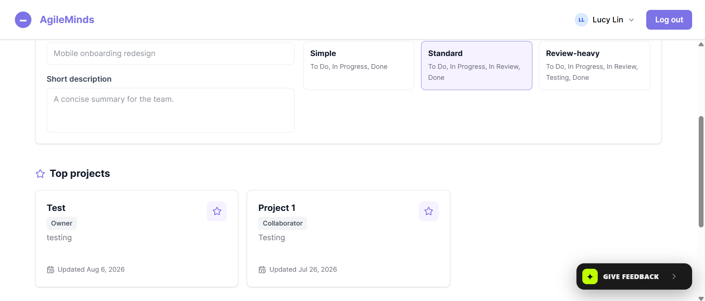
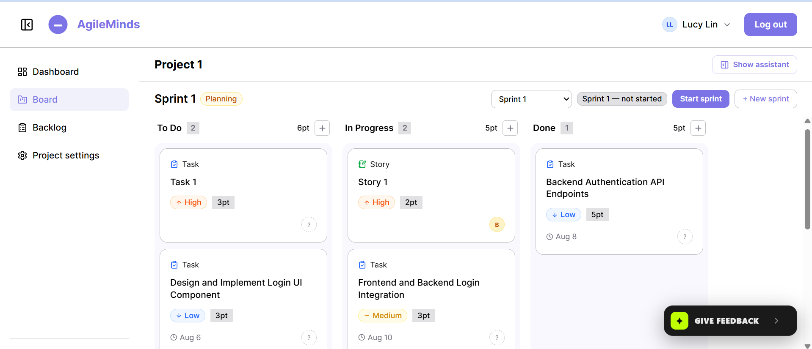
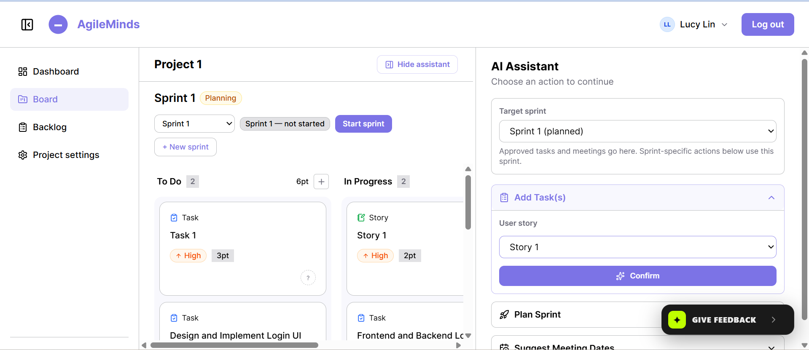
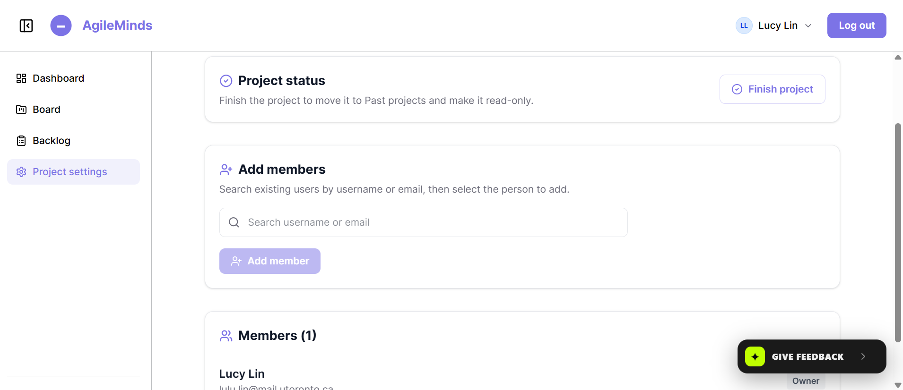
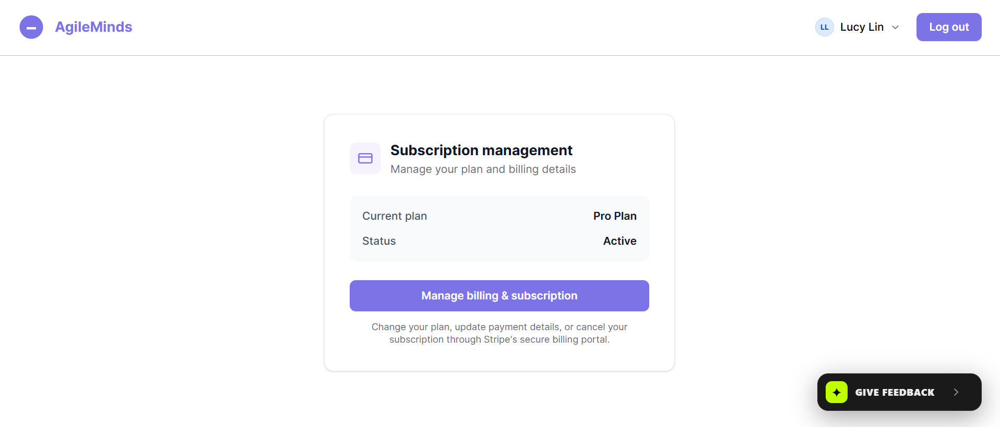
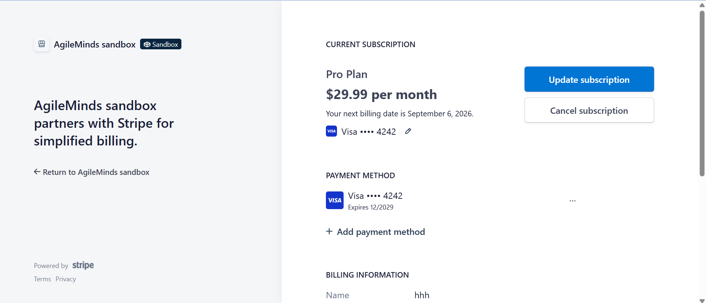

# AgileMinds – AI-Powered Agile Project Management

> **Full-stack project management platform with Gemini AI automation, real-time collaborative workflows, and enterprise-grade payments.**

---

## Project Overview

**AgileMinds** is a collaborative project management platform built to streamline software development workflows through a real-time Kanban interface and an integrated LLM assistant. 

The platform enables teams to manage backlogs, allocate user stories, and track active sprints while reducing management overhead via an **intelligent AI Scrum Master**. The AI assistant leverages **Gemini's native function/tool-calling** to read live project data (backlog, tasks, team roster, sprint schedules) before generating structured suggestions—all of which require explicit user approval before anything is written to the database.

> **Note:** The full source code for this project is kept in a private repository due to academic integrity policies. This showcase page highlights the architecture, features, and my specific contributions.

**Live Demo:** [https://app.agileminds.tech](https://app.agileminds.tech)
* To successfully complete the subscription step, please use the following **mock card number**: 4242424242424242 (all other information can be inputted randomly)

---

## Key Features

### AI-Powered Scrum Master (Gemini API)
- **Task Breakdown**: Converts raw user stories into structured, actionable technical tasks.
- **Sprint Planning**: Proposes which backlog stories to pull into a sprint based on a given sprint goal, and fills gaps with supporting tasks.
- **Meeting Scheduling**: Suggests optimal dates for Sprint Planning, Review, and Retrospective ceremonies.
- **Function/Tool-Calling**: All AI suggestions are grounded in real-time project data (fetched via server-verified read-only tools) and enforced with a strict JSON output schema.

### Real-Time Collaboration (Socket.IO)
- **Live Board Updates**: Changes to tasks, columns, and sprints are pushed instantly to all connected users.
- **Race-Condition Prevention**: Implements per-task edit locking—when one user edits a task, the edit button is dynamically disabled for all other users in real-time.
- **Instant Feedback**: Real-time "payment failed" banners and dashboard project-list refreshes.

### Secure Third-Party Integrations
- **GitHub OAuth2**: Seamless social login managed via secure token and authorization endpoint exchanges.
- **Stripe Subscriptions**: Complete payment lifecycle management with webhook endpoints for real-time tier updates and subscription confirmation.

### Enterprise-Grade Security
- **Input Validation**: Joi middleware on all endpoints.
- **ORM Protections**: Sequelize ORM to prevent SQL injection.
- **Endpoint Authorization**: Role-based access control checks on every protected route.
- **XSS Prevention**: Strict input sanitization and output encoding.

### Polished User Experience
- **React + Tailwind CSS**: Responsive, modern, and interactive UI.
- **Intuitive Interactions**: Press `Enter` to submit, `Shift+Enter` for new lines.
- **Clickable Cards**: Open projects directly by clicking anywhere on the dashboard card.

---

## Tech Stack & Architecture

| Layer | Technology |
| :--- | :--- |
| **Frontend** | React 18, Tailwind CSS, Socket.IO Client |
| **Backend** | Node.js, Express.js, Sequelize ORM |
| **Database** | PostgreSQL |
| **AI/LLM** | Google Gemini 3.5 Flash-Lite (Function/Tool Calling) |
| **Real-Time** | Socket.IO (WebSocket) |
| **Authentication** | GitHub OAuth 2.0 |
| **Payments** | Stripe API + Webhooks |
| **Deployment** | Docker, Docker Compose, Caddy Reverse Proxy, Azure VM |

### Architecture Flow

1. **User** navigates to app.agileminds.tech → **Caddy** proxies request to the **React frontend**.
2. **Frontend** makes API calls to api.agileminds.tech → **Caddy** routes to the **Express backend**.
3. **Backend** validates requests (Joi), checks authorization, and interacts with:
    * **PostgreSQL** (via Sequelize) for CRUD operations.
    * **Gemini API** (using function/tool-calling) to generate AI suggestions.
    * **Stripe API** for subscription lifecycle and webhook events.
    * **GitHub OAuth2** for user authentication token exchange.
4. **WebSocket** (Socket.IO) maintains a persistent connection between **frontend** and **backend**, enabling:
    * Real-time task/column updates.
    * Collaborative locking (disable edit buttons when another user is editing).
5. **Stripe Webhooks** notify the backend asynchronously about payment events (e.g., subscription updates), which then update the database and broadcast real-time UI feedback via Socket.IO.

---

## Screenshots

*The authentication page allows users to choose between logging in with email + password or Github account.*

*The user's dashboard, where users can create and view their projects.*

*A project's kanban board where users can add tasks/stories/bugs etc. and manage sprints.*

*The AI assistant panel where project members can utilize AI to make agile planning easier.*

*The project setting where project owner can manage project members.*

*The user's subscription management page that takes the user to Stripe's user portal.*

*The Stripe portal for the current user to manage their subscriptions.*

---

## Deployment & DevOps
- **Containerized**: Fully Dockerized environment (`docker-compose.yml`) managing Postgres, Express server, React static assets, and Caddy reverse proxy.
- **Production Domain**: `app.agileminds.tech` and `api.agileminds.tech` routed securely via HTTPS.
- **CI/CD Ready**: Designed for seamless integration with GitHub Actions (not yet configured for this showcase, but architecture supports it).

---

## My Contributions (Full-Stack Developer)

As the **Full-Stack Developer** on this 2-person team, I was responsible for:

- **Full-Stack Architecture**: Architected the React/Express/PostgreSQL stack, designing modular REST APIs and a clean project structure.
- **Stripe Integration**: Built the complete subscription lifecycle—checkout sessions, customer portal, and webhook endpoints for real-time status synchronization.
- **Real-Time Collaboration**: Implemented Socket.IO connections for live task updates and built the collaborative locking mechanism to prevent race conditions.
- **Security & Debugging**: Enforced input validation, ORM protections, and endpoint authorization. Identified and resolved critical bugs using browser dev tools and backend logs.
- **Third-Party OAuth**: Integrated GitHub OAuth2, managing the full authorization code/token exchange flow.
- **UI/UX Development**: Built responsive interfaces with React and Tailwind CSS, implementing feedback-driven features like `Enter`/`Shift+Enter` submission logic.
